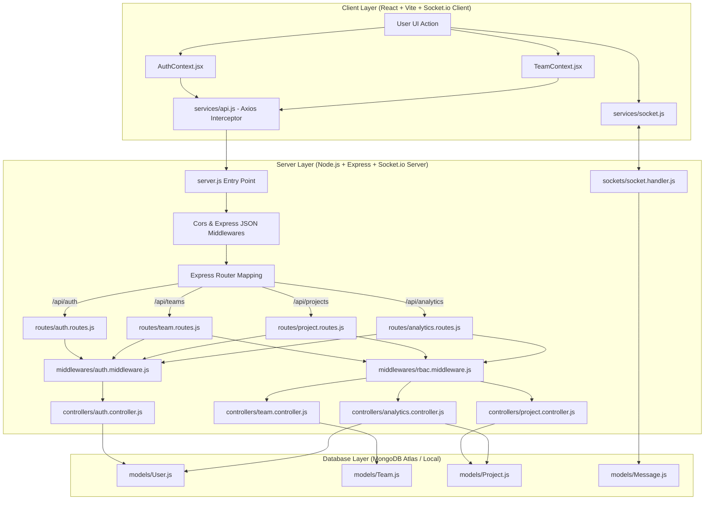
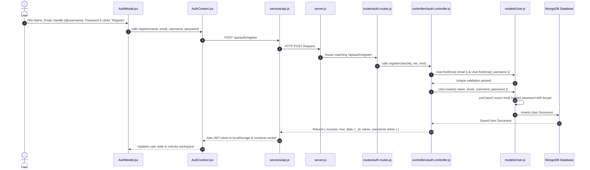
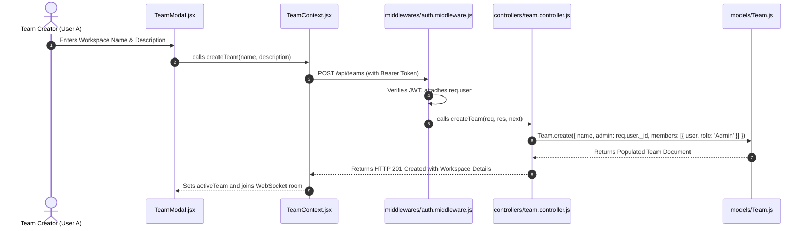
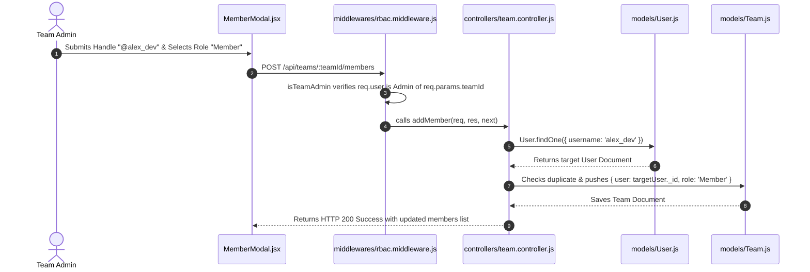
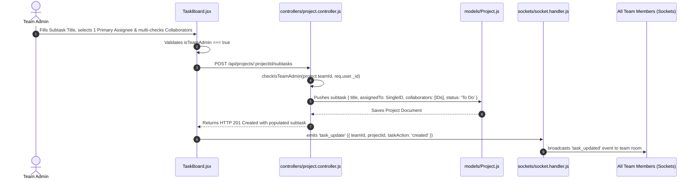
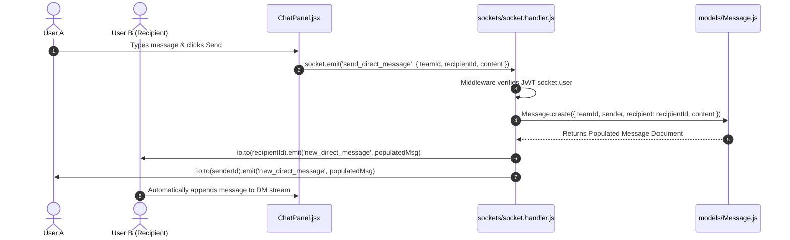
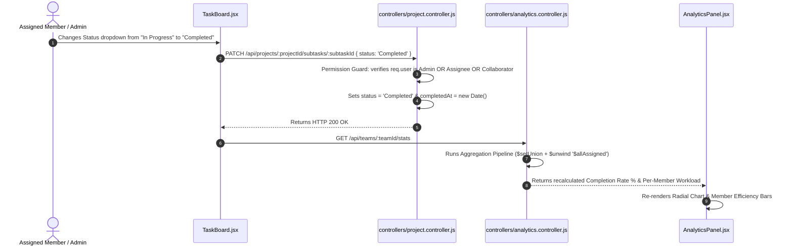

# SyncCore Complete Request Lifecycle & Code Execution Flowchart

This document provides an end-to-end technical breakdown and Mermaid flowcharts detailing how every file and function in SyncCore executes from initial User Registration to Team Creation, Member Invites, Project/Task Management, Real-Time WebSockets, and Analytics Pipeline updates.

---

## 1. Master Architecture Overview

---

## 2. Step-by-Step Lifecycle Execution Flows

### Phase A: User Account Registration

**Executing Files & Functions:**
1. **Client**: [`client/src/components/AuthModal.jsx`](file:///c:/node/SyncCore/client/src/components/AuthModal.jsx) `handleSubmit()`
2. **Client**: [`client/src/context/AuthContext.jsx`](file:///c:/node/SyncCore/client/src/context/AuthContext.jsx) `register()`
3. **Client**: [`client/src/services/api.js`](file:///c:/node/SyncCore/client/src/services/api.js) (attaches Bearer headers)
4. **Server Route**: [`server/routes/auth.routes.js`](file:///c:/node/SyncCore/server/routes/auth.routes.js) `router.post('/register', registerUser)`
5. **Server Controller**: [`server/controllers/auth.controller.js`](file:///c:/node/SyncCore/server/controllers/auth.controller.js) `registerUser()`
6. **Server Model Hook**: [`server/models/User.js`](file:///c:/node/SyncCore/server/models/User.js) `userSchema.pre('save', async function() { ... })`

---

### Phase B: Creating a Team Workspace

**Executing Files & Functions:**
1. **Client**: [`client/src/components/TeamModal.jsx`](file:///c:/node/SyncCore/client/src/components/TeamModal.jsx) `handleSubmit()`
2. **Server Middleware**: [`server/middlewares/auth.middleware.js`](file:///c:/node/SyncCore/server/middlewares/auth.middleware.js) `protect()`
3. **Server Controller**: [`server/controllers/team.controller.js`](file:///c:/node/SyncCore/server/controllers/team.controller.js) `createTeam()`
4. **Server Model**: [`server/models/Team.js`](file:///c:/node/SyncCore/server/models/Team.js)

---

### Phase C: Inviting a Team Member by Handle (@username)

**Executing Files & Functions:**
1. **Client**: [`client/src/components/MemberModal.jsx`](file:///c:/node/SyncCore/client/src/components/MemberModal.jsx) `handleAddMember()`
2. **Server RBAC Middleware**: [`server/middlewares/rbac.middleware.js`](file:///c:/node/SyncCore/server/middlewares/rbac.middleware.js) `isTeamAdmin()`
3. **Server Controller**: [`server/controllers/team.controller.js`](file:///c:/node/SyncCore/server/controllers/team.controller.js) `addMember()`

---

### Phase D: Creating a Project & Subtask (Assignee & Collaborators)

**Executing Files & Functions:**
1. **Client**: [`client/src/components/TaskBoard.jsx`](file:///c:/node/SyncCore/client/src/components/TaskBoard.jsx) `handleAddSubtaskSubmit()`
2. **Server Controller**: [`server/controllers/project.controller.js`](file:///c:/node/SyncCore/server/controllers/project.controller.js) `addSubtask()` & `checkIsTeamAdmin()`
3. **Server Model**: [`server/models/Project.js`](file:///c:/node/SyncCore/server/models/Project.js)
4. **WebSocket Server**: [`server/sockets/socket.handler.js`](file:///c:/node/SyncCore/server/sockets/socket.handler.js) `task_update` event handler

---

### Phase E: Real-Time Chat & Direct Messaging (DMs)

**Executing Files & Functions:**
1. **Client**: [`client/src/components/ChatPanel.jsx`](file:///c:/node/SyncCore/client/src/components/ChatPanel.jsx) `handleSendMessage()`
2. **WebSocket Middleware**: [`server/sockets/socket.handler.js`](file:///c:/node/SyncCore/server/sockets/socket.handler.js) `io.use()`
3. **Server Event**: [`server/sockets/socket.handler.js`](file:///c:/node/SyncCore/server/sockets/socket.handler.js) `send_direct_message` / `send_channel_message`
4. **Server Model**: [`server/models/Message.js`](file:///c:/node/SyncCore/server/models/Message.js)

---

### Phase F: Subtask Status Update & Real-Time Analytics Pipeline Update

**Executing Files & Functions:**
1. **Client UI Guard**: [`client/src/components/TaskBoard.jsx`](file:///c:/node/SyncCore/client/src/components/TaskBoard.jsx) `handleStatusChange()`
2. **Server Guard & Controller**: [`server/controllers/project.controller.js`](file:///c:/node/SyncCore/server/controllers/project.controller.js) `updateSubtask()`
3. **Analytics Pipeline**: [`server/controllers/analytics.controller.js`](file:///c:/node/SyncCore/server/controllers/analytics.controller.js) `getTeamAnalytics()`
4. **Analytics View**: [`client/src/components/AnalyticsPanel.jsx`](file:///c:/node/SyncCore/client/src/components/AnalyticsPanel.jsx)

---

## 3. Summary Map of Code Locations

| Action | Primary Client File | Primary Server Route / Controller | Database Model |
| :--- | :--- | :--- | :--- |
| **Account Registration** | [`client/src/components/AuthModal.jsx`](file:///c:/node/SyncCore/client/src/components/AuthModal.jsx#L15) | [`server/controllers/auth.controller.js`](file:///c:/node/SyncCore/server/controllers/auth.controller.js#L30) | [`server/models/User.js`](file:///c:/node/SyncCore/server/models/User.js#L46) |
| **Create Workspace** | [`client/src/components/TeamModal.jsx`](file:///c:/node/SyncCore/client/src/components/TeamModal.jsx#L15) | [`server/controllers/team.controller.js`](file:///c:/node/SyncCore/server/controllers/team.controller.js#L20) | [`server/models/Team.js`](file:///c:/node/SyncCore/server/models/Team.js#L20) |
| **Add Member (@handle)** | [`client/src/components/MemberModal.jsx`](file:///c:/node/SyncCore/client/src/components/MemberModal.jsx#L20) | [`server/controllers/team.controller.js`](file:///c:/node/SyncCore/server/controllers/team.controller.js#L110) | [`server/models/Team.js`](file:///c:/node/SyncCore/server/models/Team.js#L3) |
| **Create Subtask** | [`client/src/components/TaskBoard.jsx`](file:///c:/node/SyncCore/client/src/components/TaskBoard.jsx#L80) | [`server/controllers/project.controller.js`](file:///c:/node/SyncCore/server/controllers/project.controller.js#L180) | [`server/models/Project.js`](file:///c:/node/SyncCore/server/models/Project.js#L3) |
| **Real-Time Messages** | [`client/src/components/ChatPanel.jsx`](file:///c:/node/SyncCore/client/src/components/ChatPanel.jsx#L60) | [`server/sockets/socket.handler.js`](file:///c:/node/SyncCore/server/sockets/socket.handler.js#L60) | [`server/models/Message.js`](file:///c:/node/SyncCore/server/models/Message.js#L3) |
| **Analytics Recalculation**| [`client/src/components/AnalyticsPanel.jsx`](file:///c:/node/SyncCore/client/src/components/AnalyticsPanel.jsx#L15) | [`server/controllers/analytics.controller.js`](file:///c:/node/SyncCore/server/controllers/analytics.controller.js#L85) | [`server/models/Project.js`](file:///c:/node/SyncCore/server/models/Project.js#L39) |
